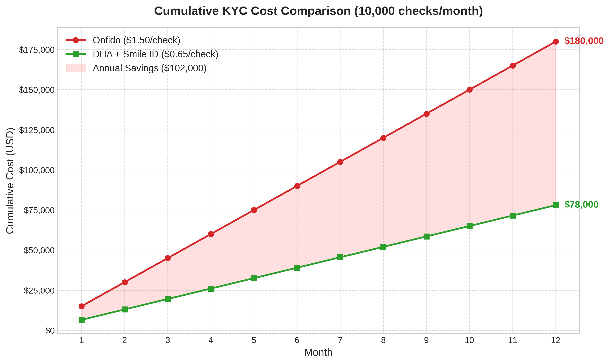

# Digzio Platform — KYC Cost Comparison Analysis

**Version:** 1.0  
**Date:** April 2026  
**Author:** Manus AI  

---

## 1. Executive Summary

This document provides a direct financial comparison between two identity verification (KYC) approaches for the Digzio platform, assuming a steady-state volume of **10,000 checks per month** (typical of the Growth stage).

The two approaches compared are:
1. **Onfido (Single Provider):** Full document OCR scanning + biometric liveness.
2. **DHA + Smile Identity (Two-Layer Stack):** Direct government ID number validation + biometric liveness.

**Key Finding:** The Two-Layer Stack reduces annual KYC operating costs by **56.6%**, generating **$102,000 in direct cash savings** per year, while providing a more authoritative verification result for the South African context.

---

## 2. Unit Economics Breakdown

### 2.1 Approach A: Onfido
Onfido relies on scanning the physical ID document (OCR) and comparing it to a selfie. Because document scanning is computationally intensive and requires global template maintenance, the unit cost is high.

* **Document Scan + Liveness:** ~$1.50 per check [1]
* **Total Cost per Check:** **$1.50**

### 2.2 Approach B: Two-Layer Stack (DHA + Smile Identity)
This approach bypasses document OCR entirely. It verifies the ID number directly against the Department of Home Affairs (DHA) database via an aggregator, then uses Smile Identity purely for the liveness selfie check.

* **Layer 1 (DHA Validation):** ~$0.15 per check (via aggregator like PBVerify or Smile Basic KYC)
* **Layer 2 (Smile Liveness):** ~$0.50 per check (Smile Identity SmartSelfie™) [2]
* **Total Cost per Check:** **$0.65**

---

## 3. Annual Financial Impact (at 10,000 checks/month)

At 10,000 checks per month, the financial divergence between the two approaches becomes massive over a 12-month operating period.

| Metric | Onfido | DHA + Smile Identity | Variance (Savings) |
|---|---|---|---|
| **Cost per Check** | $1.50 | $0.65 | **$0.85 saved per check** |
| **Monthly Cost** | $15,000 | $6,500 | **$8,500 saved per month** |
| **Annual Cost** | $180,000 | $78,000 | **$102,000 saved per year** |

---

## 4. Visualizing the $102,000 Saving

The chart below illustrates the cumulative cost of both approaches over a 12-month period at 10,000 checks per month.

---

## 5. Strategic Conclusion

The financial argument for the Two-Layer Stack is absolute. Saving **$102,000 annually** at the Growth stage provides Digzio with significant capital that can be redeployed into user acquisition, marketing, or engineering headcount.

Furthermore, the cheaper option is actually the **more secure option** for South Africa. A direct ping to the DHA database confirms the ID number is active and the person is alive — something a document scanner cannot definitively prove if the physical card is a high-quality forgery.

**Recommendation:** Digzio must adopt the DHA + Smile Identity stack before scaling beyond the MVP phase.

---

## 6. References
[1] Industry standard pricing for full-suite document + biometric KYC providers.  
[2] Smile Identity Pricing and Product Structure: https://usesmileid.com/pricing  
