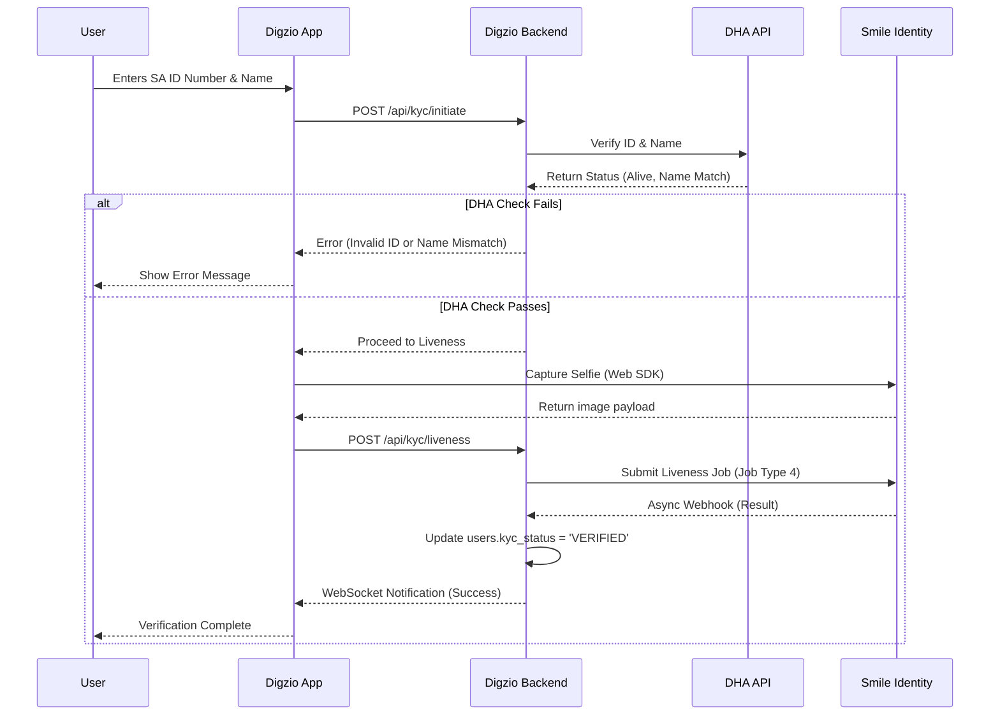

# Digzio Platform — Two-Layer KYC Integration Specification

**Version:** 1.0  
**Date:** April 2026  
**Author:** Manus AI  

---

## 1. Executive Summary

To achieve the most authoritative and cost-effective identity verification for South African users, Digzio implements a **Two-Layer KYC Stack**:

1. **Layer 1: DHA Identity Verification** — Direct validation of the South African ID number against the Department of Home Affairs (DHA) population register.
2. **Layer 2: Smile Identity Liveness Check** — A biometric selfie check to confirm the person applying is a real, live human being.

This approach bypasses the need for expensive and error-prone document OCR (Optical Character Recognition) scanning. By validating the ID number directly with the government and pairing it with a biometric liveness check, Digzio achieves higher security at approximately 50% of the cost of full document verification [1] [2].

---

## 2. Verification Data Flow

The verification process is entirely asynchronous and decoupled from the main user registration flow to ensure fast onboarding.



---

## 3. Layer 1: DHA Identity Verification

The first layer verifies that the provided South African ID number exists, belongs to a living person, and matches the provided first name and surname. This is typically accessed via an aggregator (e.g., PBVerify, TransUnion, or Smile Identity's Basic KYC endpoint) that has direct DHA links.

### 3.1 API Contract (Internal Digzio Endpoint)

**Endpoint:** `POST /api/v1/kyc/verify-id`  
**Authentication:** Bearer Token (JWT)

**Request Body:**
```json
{
  "id_number": "9901015000087",
  "first_name": "Sipho",
  "last_name": "Nkosi"
}
```

**Success Response (200 OK):**
```json
{
  "success": true,
  "data": {
    "id_number": "9901015000087",
    "is_valid": true,
    "is_alive": true,
    "name_match_score": 95,
    "gender": "M",
    "dob": "1999-01-01"
  }
}
```

### 3.2 Error Handling

If the DHA check fails (e.g., the ID number does not exist or the person is marked as deceased), the process terminates immediately. The user is not allowed to proceed to the liveness check, saving API costs.

---

## 4. Layer 2: Smile Identity Liveness Check

Once the ID number is validated, Digzio must prove that the person holding the phone is a real human being (not a photograph or mask). This is achieved using Smile Identity's **SmartSelfie™** (Job Type 4 - Basic KYC with Liveness) [2].

### 4.1 Node.js Server-to-Server Integration

Digzio uses the `smile-identity-core` Node.js SDK to submit the liveness job [2].

#### Installation
```bash
npm install smile-identity-core
```

#### Implementation Example
```javascript
const { WebApi } = require("smile-identity-core");

// Initialize Smile ID Client
const connection = new WebApi(
  process.env.SMILE_PARTNER_ID,
  process.env.SMILE_CALLBACK_URL,
  process.env.SMILE_API_KEY,
  1 // 1 for Production, 0 for Sandbox
);

async function submitLivenessJob(userId, base64Selfie) {
  const partnerParams = {
    job_id: `job_${Date.now()}_${userId}`,
    user_id: userId,
    job_type: 4 // Job Type 4: Basic KYC with Liveness
  };

  // Image Type 2: Base64 encoded selfie image
  const imageDetails = [
    {
      image_type_id: 2,
      image: base64Selfie
    }
  ];

  // No ID document needed here because we already verified the ID number via DHA
  const idInfo = {
    country: 'ZA',
    id_type: 'NATIONAL_ID'
  };

  const options = {
    return_job_status: false, // Async webhook processing
    return_history: false,
    return_image_links: false,
    signature: true
  };

  try {
    const response = await connection.submit_job(partnerParams, imageDetails, idInfo, options);
    return response.smile_job_id;
  } catch (error) {
    console.error("Smile ID Submission Failed:", error);
    throw error;
  }
}
```

### 4.2 Webhook Handling (Asynchronous Result)

Smile Identity processes the liveness check and sends the result to the Digzio callback URL.

**Endpoint:** `POST /api/v1/webhooks/smile-identity`

**Expected Payload from Smile ID:**
```json
{
  "SmileJobID": "0000000046",
  "PartnerParams": {
    "job_id": "job_1680000000_user123",
    "user_id": "user123",
    "job_type": "4"
  },
  "ResultCode": "0810",
  "ResultText": "Liveness Check Passed",
  "Actions": {
    "Liveness_Check": "Passed",
    "Register_Selfie": "Approved"
  },
  "signature": "---signature---"
}
```

**Digzio Processing Logic:**
1. Verify the `signature` using the Smile ID API Key to ensure the webhook is authentic.
2. Check `Actions.Liveness_Check`. If `"Passed"`, update the Digzio database:
   ```sql
   UPDATE users 
   SET kyc_status = 'VERIFIED', updated_at = NOW() 
   WHERE id = 'user123';
   ```
3. Emit a WebSocket event to the frontend so the user sees the "Verification Successful" screen immediately.

---

## 5. Security & POPIA Compliance

This two-layer approach is inherently more secure and privacy-compliant than traditional document scanning:

1. **Zero PII Storage:** Digzio never stores the user's selfie or ID document image. The selfie is passed directly to Smile Identity as a base64 string in memory and immediately discarded.
2. **Data Minimization:** By not requiring users to photograph their physical ID card, Digzio avoids storing highly sensitive images that could be exploited in a data breach.
3. **Liveness First:** The liveness check prevents automated bot registrations and spoofing attacks.

---

## 6. References
[1] Smile Identity Official Website: https://usesmileid.com/  
[2] Smile Identity Node.js Server-to-Server Integration: https://docs.usesmileid.com/integration-options/server-to-server/javascript/products/document-verification  
